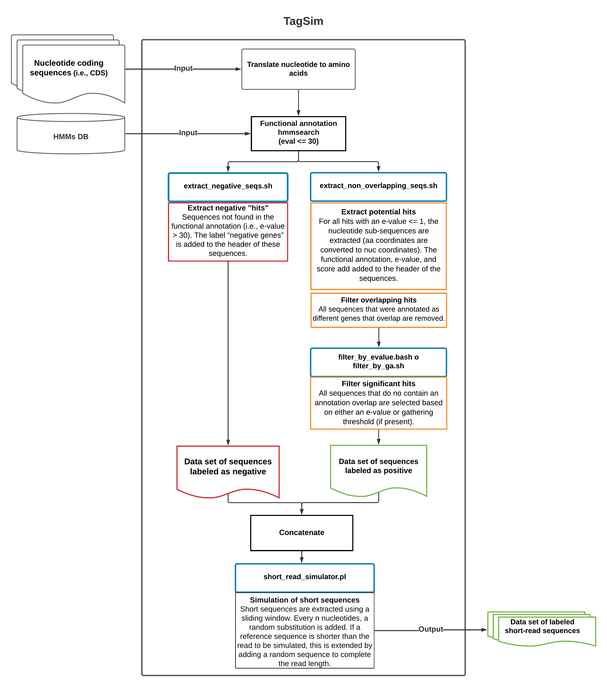

# TagSim
### Tagged short-read sequences simulator

```
Usage: ./tagsim.sh <options>
--help                          print this help
--config_file CHAR              configuration file (default /home/epereira/workspace/repositories/tools/tagsim/code/conf.sh")
--clean t|f                     clean all intermediate files (default f)
--filter_by_evalue t|f          filter positive domains by evalue (default f)
--filter_by_ga t|f              filter positive domains by GA (default f)
--filtering_evalue NUM          maximum evalue used to filter positive domains - only used when "--filter_by_evalue t" (default 0.1)
--hmm_file CHAR                 HMM file to annotate reference sequences
--error_rate NUM                error rate of simulated short read sequences (default 1e-3)
--input_dir CHAR                input amino acid fasta file (i.e., .faa)
--max_evalue                    maximum evalue to consider to filter overlapping hits (default 1)
--nslots NUM                    number of threads used (default 4)
--output_dir CHAR               directory to output generated data
--overwrite t|f                 overwrite directory (defaould f)
--query_field CHAR              field to parse hmmsearch output: accession or name (default accession)
--read_length NUM               comma separated read lengths of simulated short reads (default 100,200,300)
--slide_window NUM              sliding window to extract short reads (default 30bp)
--subsample_n                   subsample negative domains n times the number of potential domains (default 1)
--verbose t|f                   output verbose (default t)
```

#### Workflow:

